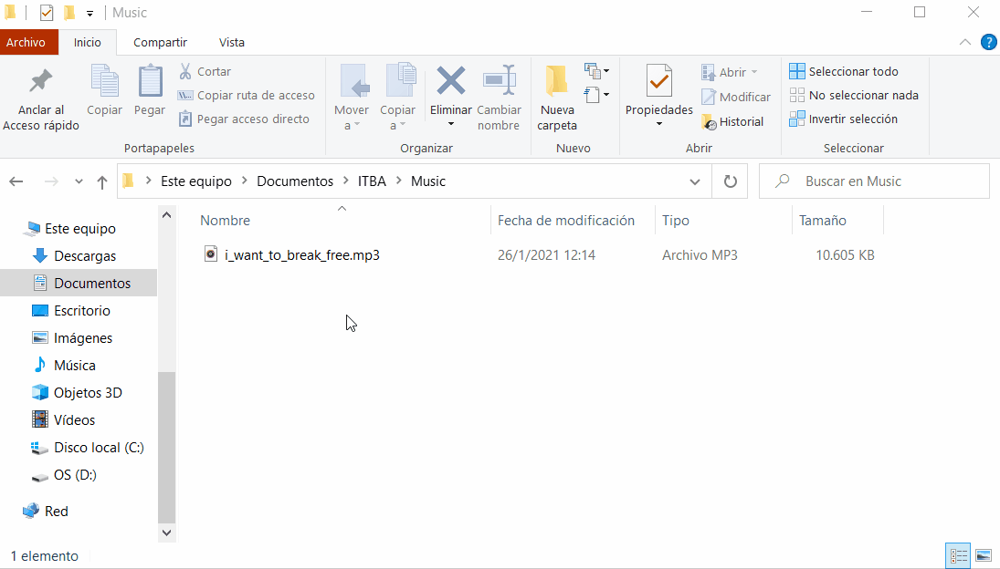

<h1 align="center">
    Mp3 Decoder
  <br>
</h1>

<h3 align="center">A program made with C</a></h3>
<p align="center">
  • <a href="#what-is-it">What it is</a>
  • <a href="#how-to-run">How to run</a>
  • <a href="#preview">Preview</a>
</p>
<br>

## What it is

This is an mp3 Decoder made for the "Microprocessor lab" chair ITBA 2020.

The idea behind this project is to create a Mp3 Decoder that can create a .wav file decoding the mp3 file.

When it does that it show also in the command line the ID3 Tags of the song, some information about the file like the size and the number of frames decoded and a loading bar to show the state of the decoder process.

## How to Run

The easy way to run this program is opening the solution with Visual Studio IDE and tapping Local Windows Debugging button. Another way is compiling the source code by hand with the command console.

In either case you must change some #defines to select the correct path to your mp3 file.

In the main.c file you can find this code:

```
// Here comment the others posibilities and uncomment the right song

//#define HAYDN
//#define ODA_A_LA_ALEGRIA
#define QUEEN
//#define YOUR_SONG


// Here put the path of the song that you want to decode

//#ifdef YOUR_SONG
//#define FILEPATH		"C:/The/filepath/of/your/song.mp3"
//#define FILEPATH_WAV	"C:/The/filepath/of/your/decoded/song.wav"
//#endif
```

After selecting the correct path of your song and uncommented the right define, you will be able to run the programm and after the program finishes its execution you will see the decoded .wav file in the selected path.

<br>

## Preview
<br>

